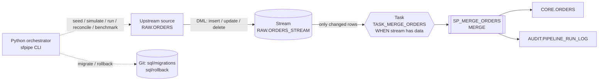

# Architecture

## Why this design
- **Stream** records row-level changes since the last consumption, so only the delta is read.
- **Task `WHEN SYSTEM$STREAM_HAS_DATA`** skips runs when nothing changed, so the warehouse is not resumed.
- **MERGE** applies inserts/updates/deletes atomically; the stream offset advances only when the transaction commits, so a failed run is retried with no data loss.
- **Audit log** records rows inserted/updated/deleted and duration per run.
- **Migrations** are versioned SQL in Git with checksums; **rollback** scripts undo each change.

## CDC semantics handled in the MERGE
| Source operation | Stream rows (METADATA$ACTION / ISUPDATE) | Target effect |
|---|---|---|
| INSERT | INSERT / FALSE | insert |
| UPDATE | DELETE / TRUE + INSERT / TRUE | update (DELETE half ignored) |
| DELETE | DELETE / FALSE | delete |
| INSERT then DELETE inside one window | nothing | nothing |
